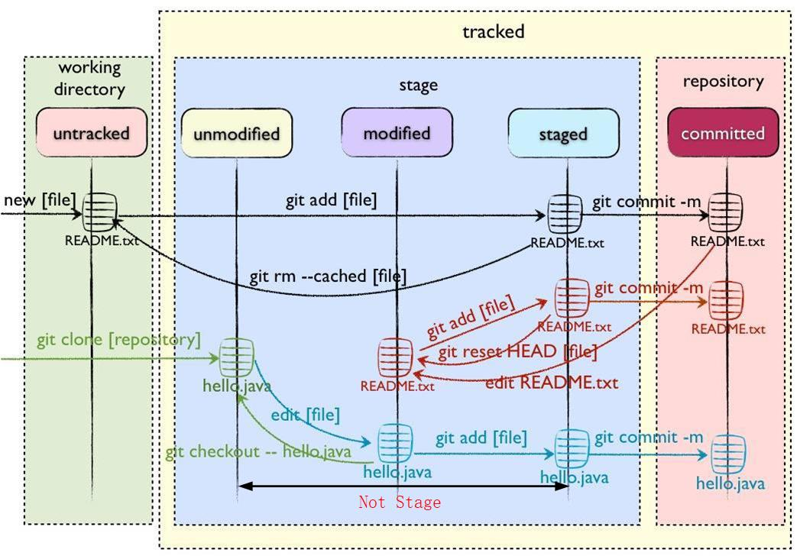

# MyRepository      
#分行：末尾加两个tab        
搭建教程：https://www.jianshu.com/p/c52e356ea1fd        
https://www.cnblogs.com/Gbeniot/p/5198592.html      
#修改文件后，怎么提交到远程仓库     
    git status 查看git是否有修改内容需要提交        
    git add 指向需要提交的内容文件      
    git commit 提交到`本地库`       
    git push origin master 提交到`远程仓库`     
#添加用户名和邮箱:      
git config --global user.name "myname"      
git config --global user.email "myname@mymail.com"      
#连接远程仓库:git remote add origin `窗库远程地址`      
```python
print("vscode use markdown try")
```    
有序列表
1. 123
2.  345
3.   456
- 789
-  123
   -  456
      -  789
                  
##加粗、加斜        
**真好用**
***加斜***      

```python       
print("helloWorld")               
cd ~/catkin_ws      
catkin_make     pppp
```    


#### windows下 使用cmake
1. 基本工程步骤和Ubuntu一致
2. 用vs打开sln文件,右键HelloWorld `选择设为启动项`
3. 编译、运行       


#### git使用问题
git status 不能`显示中文`:git terminal run：git config --global core.quotepath false

git 一次性add 多个文件或提交多次修改
git add -all
git commit -m 'add more file'
git push origin master
#### git 提交多个文件
* git add file1 file2 file3
* git config/* 提交config 目录下的所有文件
* git home/*.hpp
* git add -all git add .

#### git 只提交部分修改的文件:
1. 把修改的文件add 到暂存区
2. 忽略其他文件，把现修改隐藏起来 git stash -u -k
3. 恢复之前忽略的文件 git stash pop

#### git 状态
* not stage:add过的文件，即跟踪文件，再次修改没有add，就是没有暂存的意思
* untrack:是新文件，没有被add过，是为跟踪的意思

#### 插入图片


<div align=right></div>


